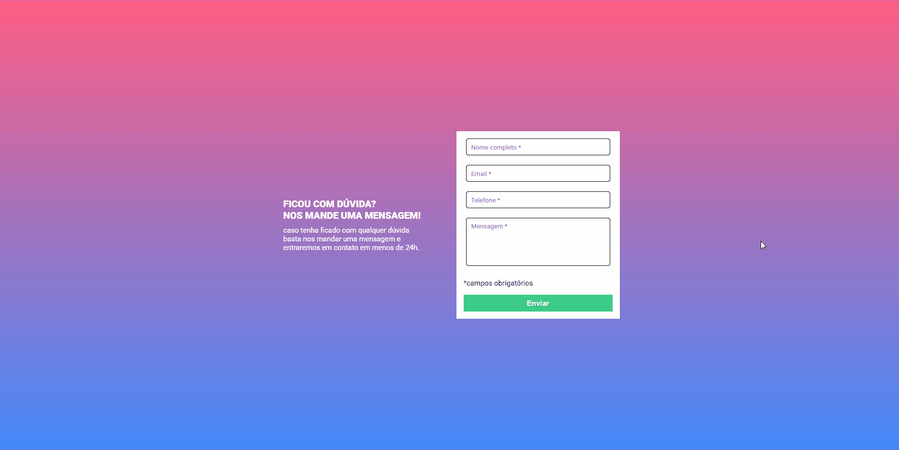
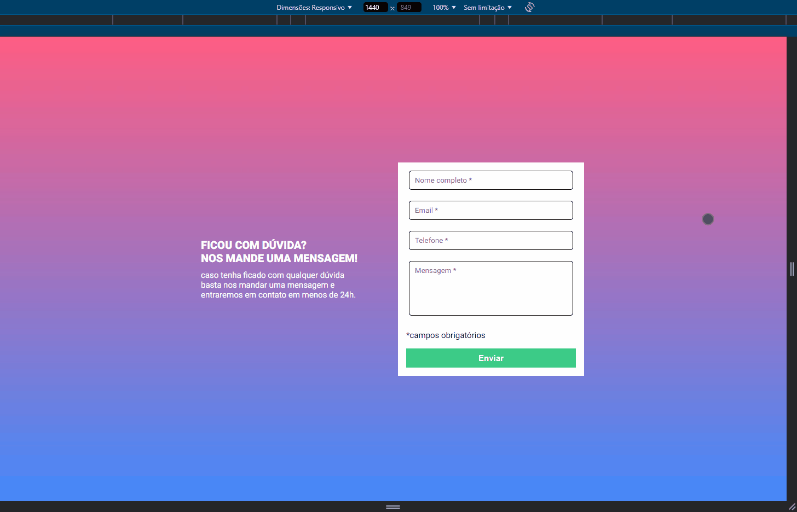

# Quest - Módulo Intermediário de JavaScript

## Visão geral

### Quest - Formulário
Criar um formulário com validação

#### Pontos de atenção

- A validação do formulário deve ser feita com javascript puro.
- Ao clicar para enviar o formulário, se caso algum campo não estiver preenchido, a borda do input deve ficar vermelha e uma mensagem de "campo obrigatório" deve aparecer embaixo do campo que não foi preenchido, conforme o figma.
- O fundo do formulário deve ser feito usando a imagem em anexo na aula.

**IMPORTANTE:** Esse site é um exercício do curso e ele não foi pensado em responsividade ou em ser postado, o que importa nele é a interação do JS e não o site em sí. Eu só achei ele legal e decidi postar, portanto essa "responsividade" feita foi só uma 'gambiarra' para o site poder funcionar em telas de celular também, dito isso fique a vontade para seguir em frente ^^.

## Preview 🎴

### Desktop Preview


### Mobile Preview


### Links 🔗

- Site: [Live Site](https://ramon-alvez.github.io/DevQuest-Quest-JS-intermedi-rio-Desafio-Formul-rio-com-validacao/)
- Repositório: [GitHub](https://github.com/Ramon-Alvez/DevQuest-Quest-JS-intermedi-rio-Desafio-Formul-rio-com-validacao)

---

### Figma 🎨

#### Modelo do formulário


#### Confirmação inválida


#### Confirmação válida


---

## Processo 🧱

### O que eu aprendi 📚

Consegui solucionar esta quest tranquilamente, o desafio consistia em criar um formulário com uma validação de preenchimento de campos obrigatórios, embora eu tenha conseguido fazer o front e o JS sem dificuldades houve uma certa dificuldade com relação ao formulário que vou explicar na sessão de Desafios.

Estou bem contente com o resultado final, com a responsividade e com o código JS, dessa vez eu consegui manipular o DOM e criar meu código tranquilamente, porém minha dificuldade com funções ainda segue, como nesse exercício não achei necessário usar funções eu espero poder praticar isso nos próximos módulos do curso.

### Desafios 🏋️

Como dito anteriormente a unica parte que apresentou um "problema" foi o formulário, se observarem os commits realizados verão que no começo eu estava usando a tag form, porém ao clicar em enviar ele não mostrava as bordas e a mensagem (quando necessário), eu troquei por uma div pois o exercício era só a verificação se o campo foi preenchido ou não.

### Comparação:

- Antes

``` html
 
<form id="formulario">
    <input class="inputDados" type="text" name="nome" id="nome" placeholder="Nome completo *">
    <span class="campoObrigatorio">campo obrigatório</span>

    <input class="inputDados" type="email" name="email" id="email" placeholder="Email *">
    <span class="campoObrigatorio">campo obrigatório</span>

    ...

    <input id="botaoEnviar" type="submit" value="Enviar">
</form>

```

- Depois


``` html
 
<div id="formulario">
    <input class="inputDados" type="text" name="nome" id="nome" placeholder="Nome completo *">
    <span class="campoObrigatorio">campo obrigatório</span>

    <input class="inputDados" type="email" name="email" id="email" placeholder="Email *">
    <span class="campoObrigatorio">campo obrigatório</span>

    ...

    <input id="botaoEnviar" type="submit" value="Enviar">
</div>

```

Ao terminar o desafio com a minha própria capacidade eu fui dar uma pesquisada em como resolver isso e eu encontrei alguns exemplos, porém eu não sei se isso é algo que vai ser abordado mais para frente no curso ou se já era para eu saber disso.

Enfim, além disso em um desses exemplos eu vi até uma forma de melhorar minha estrutura no html e css, estou animado para por todos esses conhecimentos em prática.

---

### Tempo gasto

Hora início: 12:00 <br>
Hora de término: 13:45 (aproximadamente)

---

### Desenvolvimento contínuo 🚀

Finalmente finalizei o módulo intermediário de JS e agora meu próximo passo é o módulo avançado, estou muito animado para aprender essa linguagem e me tornar um desenvolvedor!

Ao finalizar o módulo de Desenvolvimento Frontend pretendo ir para o Frontend Mentor por a mão na massa e fixar ainda mais o conhecimento na minha cabeça. 

## Autor 🧙‍♂️

- GitHub - [Ramon Alvez](https://github.com/Ramon-Alvez)
- LinkedIn - [@Ramon Alvez](https://www.frontendmentor.io/profile/Ramon-Alvez)